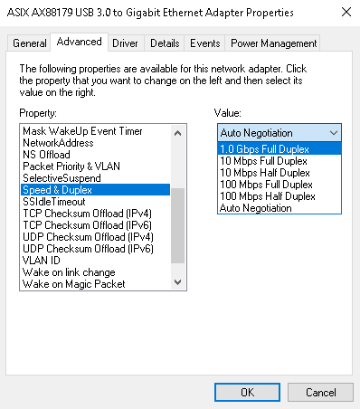

# Slow LAN Speed
***

Before concluding that there is issue with the port, make sure to check the following

### LAN Cable :

Make sure your cable is CAT 5e and better (6, 6e, etc.) that you can get easily in TechM.


***

### Ethernet Adapter properties :

Its easy to check ethernet properties of your ethernet adapter.

**For Linux users**

```shell-session
$ ip link list
1: lo: <LOOPBACK,UP,LOWER_UP> mtu 65536 qdisc noqueue state UNKNOWN mode DEFAULT group default qlen 1000
    link/loopback 00:00:00:00:00:00 brd 00:00:00:00:00:00
2: eno2: <BROADCAST,MULTICAST,UP,LOWER_UP> mtu 1500 qdisc fq_codel state UP mode DEFAULT group default qlen 1000
    link/ether 24:4b:fe:6f:4f:b4 brd ff:ff:ff:ff:ff:ff
    altname enp3s0
3: wlo1: <NO-CARRIER,BROADCAST,MULTICAST,UP> mtu 1500 qdisc noqueue state DOWN mode DORMANT group default qlen 1000
    link/ether 3c:58:c2:da:d9:69 brd ff:ff:ff:ff:ff:ff
    altname wlp0s20f3
...
more info
```

In this case `eno2` is my ethernet adapter. So next use `ethtool`, if not present google how to install (for unix/linux only).

```shell-session
$ ethtool eno2
Settings for eno2:
	Supported ports: [ TP	 MII ]
	Supported link modes:   10baseT/Half 10baseT/Full
	                        100baseT/Half 100baseT/Full
	                        1000baseT/Full
                           
...
more info 
```

As you can see it shows `1000baseT/Full`. This means my adapter supports 1000 Mbps ( 1Gbps ) with Full Duplex.

#### For windows users: [Check this post](https://www.windowscentral.com/how-determine-wi-fi-and-ethernet-connection-speed-windows-10)

?> If your speed is less than 1Gbps, check your laptop manual online. If it shows it supports 1Gbps, update your drivers.

***

### Disable auto-negotiation

<mark style="color:green;"></mark>:white\_check\_mark: <mark style="color:green;"></mark> This is really important section. Wait for at least a few hours after changing settings to see its effect.

Sometimes even though everything is correct the speed gets capped around `75Mbps`. This is due to the LAN server auto negotiates to a speed which can be used by both the parties (server and client). You can force the speed and duplex to full speed.

!> This may not work for everybody so your connection **will go out** for a moment but it will come back soon. If it doesn't connect at all (at present or in future cases) then revert the changes to auto.

**For Linux users:**

This method worked for me (tested on Linux) and after a system restart my speed shot up from `75mbps` to directly `700-800Mbps`. I used ethtool again for this.

```shell-session
$ sudo ethtool -s [device_name] speed [10/100/1000] duplex [half/full] autoneg [on/off]
```

Here device\_name is obtained from `ip link list` (the same from previous step). Speed is in Mbps - 1000 means 1Gbps, and duplex is the communication multiplexing - full means both ways. autoneg will be off.

In my case (since the institute network supports 1Gbps we can use full duplex, it's less probable that it will cause issues like more collisions - [see here](https://en.wikipedia.org/wiki/Duplex\_mismatch). The insti server auto negotiates and we won't so maybe a mismatch. ) I used this command :

```shell-session
$ sudo ethtool -s eno2 speed 1000 duplex full autoneg off
```

To revert back:

```shell-session
$ sudo ethtool -s eno2 speed 1000 duplex full autoneg on
```

#### For Windows users : [Follow this guide](https://docs.microsoft.com/en-us/azure/devops/reference/xml/configure-network-adapter-automatically-adjust-speed?view=tfs-2013). **But**, in the last step instead of `Auto`, select `1.0 Gbps Full Duplex`.



> Note: If still the network is slow, then it must be the issue with the port or the entire network is slow due to maintainence.
